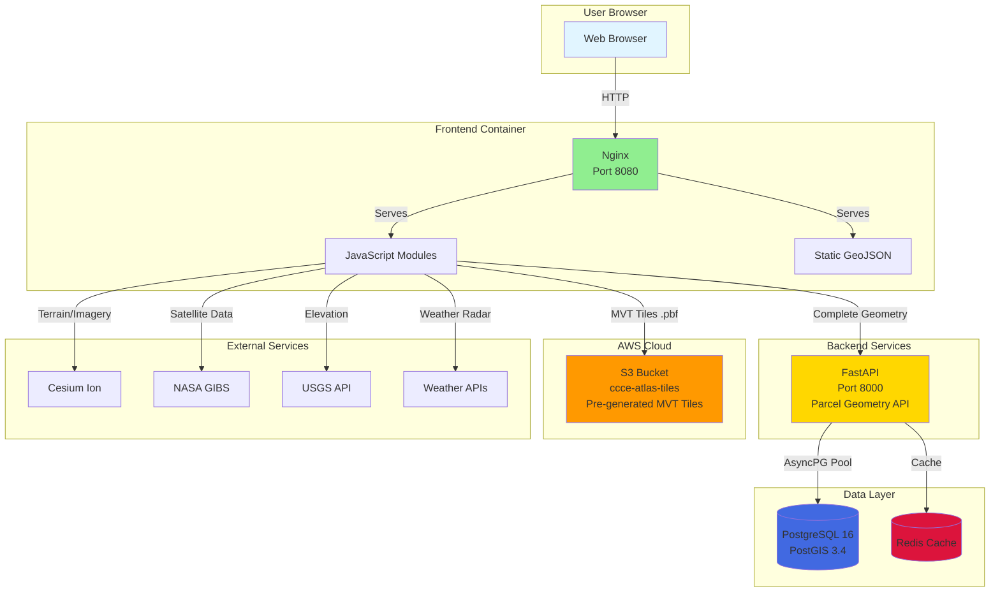
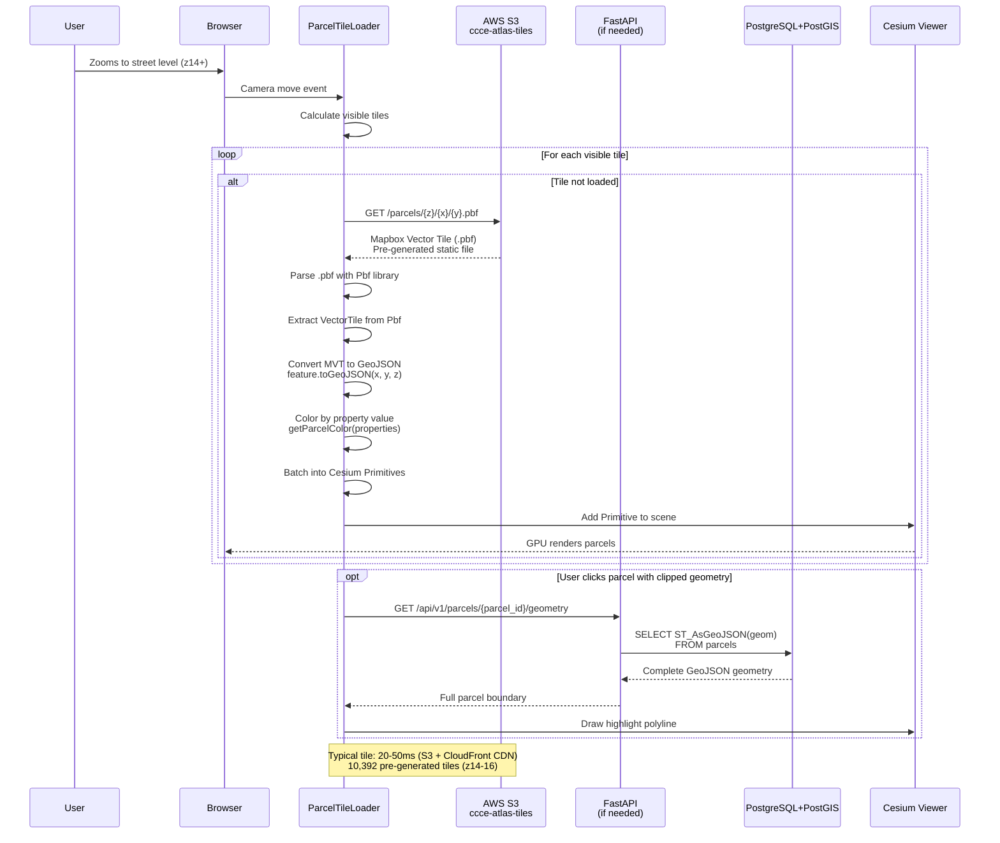
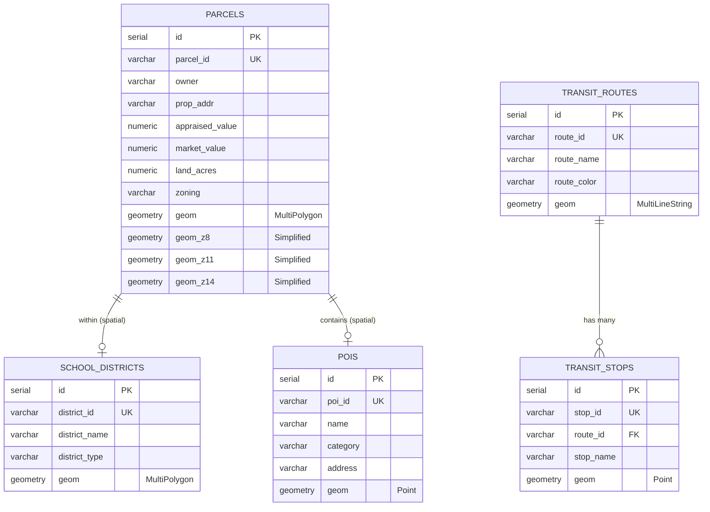
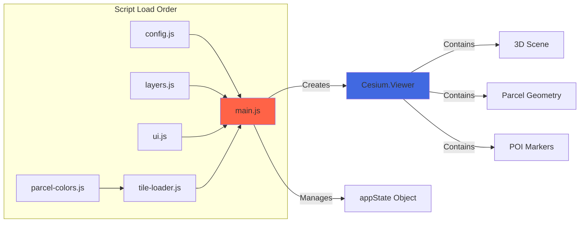

# CCCE Atlas

**Corpus Christi Civic Explorer** - Geospatial platform for exploring Corpus Christi / Nueces County civic data.

[](https://opensource.org/licenses/MIT)

## Live Deployment

- **Frontend:** https://atlas.ccce.dev
- **API:** https://api.atlas.ccce.dev/docs

## What's Available

Production deployment on AWS:
- **156,000 Property Parcels** - Nueces County Appraisal District data with ownership, valuation, and zoning
- **80+ Points of Interest** - 8 categories: beaches, trails, coffee, restaurants, libraries, bookstores, activities, community centers
- **43 Transit Routes** - CCRTA bus system with 2,000+ stops
- **School Districts** - Elementary, middle, and high school boundaries
- **Property Analytics** - Top 40 owners by acreage, parcel count, and value

## Features

### Core Visualization
- **3D Globe Visualization** - Interactive Cesium.js-powered map with WebGL rendering
- **Vector Tile System** - High-performance parcel rendering (156K parcels at 60fps)
- **Multi-Selection** - Cmd/Ctrl+Click to compare multiple properties side-by-side
- **Color-Coded Parcels** - Visual property value distribution

### Data & Layers
- **Time-Dynamic Data** - NASA GIBS satellite imagery with date picker (2000+)
- **Live Weather Radar** - Real-time precipitation from RainViewer
- **Multiple Base Maps** - Bing Aerial (15cm), Google Satellite, NASA imagery, OpenTopoMap
- **7 Overlay Layers** - Aviation sectional, nautical charts, railways, trails, weather, science data
- **3D Buildings** - OSM Buildings for downtown areas

### Interactive Features
- **Spatial Queries** - Find POIs and transit near any point
- **Category Filtering** - Search by POI type (coffee, beaches, trails, etc.)
- **Geospatial Analysis** - Point-in-polygon, distance calculations
- **Run Club Tour** - Animated flythrough of downtown 5K route
- **Property Information** - Click parcels for detailed owner, value, zoning data
- **MCP Integration** - Query from AI chat applications

## API Endpoints

**Spatial Queries:**
- `GET /api/v1/spatial/pois/near` - Find POIs near a point (optional `category` filter)

**Points of Interest:**
- `GET /api/v1/pois/` - List POIs
- `GET /api/v1/pois/categories` - Available categories

**Transit:**
- `GET /api/v1/transit/routes` - All bus routes
- `GET /api/v1/transit/stops` - All bus stops

Full interactive documentation: https://api.atlas.ccce.dev/docs

## Data Sources

- **POIs** - Curated civic amenities (31 locations)
- **Transit** - CCRTA GTFS feed (84 routes)

All data is public domain or properly licensed.

## Tech Stack

- **Frontend:** Cesium.js 1.115 + Vanilla JavaScript (ES6+)
- **Tile Delivery:** AWS S3 + CloudFront CDN (Pre-generated MVT tiles)
- **Backend API:** FastAPI + Uvicorn (Python async)
- **Database:** PostgreSQL 16 + PostGIS 3.4
- **Cache:** Redis 7
- **Infrastructure:** Docker + Docker Compose + AWS (EC2, RDS, S3, CloudFront)

## Architecture

### System Overview

High-level view of all services and their connections:



### Vector Tile Data Flow

How 156K parcels flow from S3 to screen:



### Database Schema



**Key Performance Features:**
- Pre-generated MVT tiles (10,392 tiles, 106MB total) served from AWS S3
- CloudFront CDN delivers tiles in 20-50ms globally
- GIST spatial indexes for geometry lookup API (parcel highlighting only)
- Cesium Primitives API batches geometry for GPU rendering
- Zero database load for tile rendering

### Frontend Architecture

JavaScript module loading and initialization:



For detailed architecture documentation, see [internal-docs/ARCHITECTURE_DIAGRAM.md](internal-docs/ARCHITECTURE_DIAGRAM.md).

## Performance

- **156K parcels** rendered at 60fps using Cesium Primitives API
- **Tile load times**: 20-50ms from S3 + CloudFront CDN
- **Zero database queries** for tile rendering (pre-generated static tiles)
- **Database queries**: 1-100ms with PostGIS (parcel geometry lookup only)
- **Parcel click response**: 10-50ms
- **Data size**: 10,392 MVT tiles, 106MB total (~10KB per tile)

## Development

### Prerequisites
- Docker & Docker Compose
- Cesium ion access token (free at https://ion.cesium.com)

### Quick Start

```bash
# Clone repository
git clone https://github.com/en-mac/ccce-atlas.git
cd ccce-atlas

# Configure Cesium token
cp apps/map/public/js/config.example.js apps/map/public/js/config.js
# Edit config.js and add your Cesium ion token

# Start all services
docker-compose -f infra/docker-compose.yml up -d

# Open browser
open http://localhost:8080
```

### Services

| Service | Port | Description |
|---------|------|-------------|
| Frontend (Nginx) | 8080 | Static web app |
| FastAPI | 8000 | REST API (parcel geometry lookups) |
| PostgreSQL + PostGIS | 5432 | Database (geometry API only) |
| Redis | 6379 | Cache |
| AWS S3 + CloudFront | N/A | Pre-generated MVT tiles (10,392 tiles) |

## Documentation

- [Architecture Diagrams](internal-docs/ARCHITECTURE_DIAGRAM.md) - Comprehensive system diagrams
- [Architecture Overview](internal-docs/ARCHITECTURE_SIMPLIFIED.md) - Text-based architecture guide
- [Features](internal-docs/FEATURES.md) - Detailed feature documentation
- [Narrative](internal-docs/NARRATIVE.md) - Project story and technical decisions
- [API Documentation](internal-docs/API_IMPLEMENTATION.md) - REST API reference
- [Deployment Guide](internal-docs/DEPLOY.md) - Production deployment instructions

## Advanced Cesium Features

This project demonstrates 7 advanced Cesium.js features:

1. **Metadata Styling** - Parcels colored by appraised value with dynamic legends
2. **Time-Dynamic Data** - NASA GIBS satellite imagery with date picker, live radar
3. **API Integration** - 5 external services (USGS, NASA, OpenWeatherMap, RainViewer, AWS S3)
4. **Geospatial Analysis** - Point-in-polygon, spatial queries, distance calculations
5. **Advanced Camera Control** - Automated tours, smooth interpolation, precise positioning
6. **Intuitive UI** - Sidebar with layer controls, info panels, filters
7. **Custom Providers** - Multiple base layers, overlays, terrain toggle, 3D buildings

Built for [Cesium Certified Developer](https://cesium.com/learn/certification/) certification.

## License

MIT License - see [LICENSE](LICENSE) file for details.

---

**Built for Corpus Christi** 🌊
**Cesium Certified Developer Application** - March 2026
